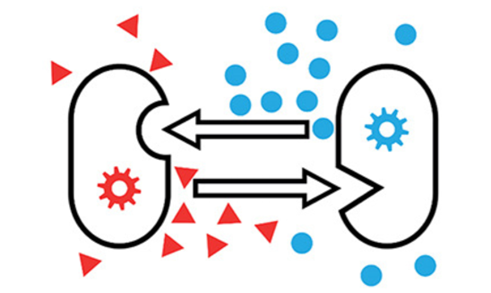

Extracellular Polymeric Substances Enhance Cross-Feeder Resilience to Cheaters
Author: Chiu, Yi-Jui, Hsiu-Chi Tsai (蔡秀吉).
1 Arete Honors Program, National Yang Ming Chiao Tung University

---

Different bacterial species often share habitats, giving rise to interspecific interactions ranging from antagonism to cooperation. Because self production of essential nutrients is costly, some species reduce or even lose the pathways for biosynthesis. As these functions decline, they rely on partners that supply the missing nutrients and offer other benefits in return. This, in turn, leads to cross-feeding.

Cross-feeding, a prevalent form of cooperation within microbial communities, takes place in the surface waters of lakes and oceans, submarine volcano, soil, human intestine, etc. Generally, two species form a cross-feeding pair; each secretes an essential nutrient (e.g. metabolite) that the partner cannot synthesize. (Fig. 1)

> Fig. 1 Schematic of Cross-feeding. D’Souza et al., Nat. Prod. Rep., 2018

Some mutated members of cross-feeding communities become cheaters that only consume and do not secrete. In classical ecology theory, these cheaters are expected to have higher fitness because they pay no secretion cost. As they spread, they can eliminate cross-feeders and collapse the community. For this reason, people study how cross-feeders persist in the face of cheaters.

As a widespread form of microbial life, biofilms embed cells in an extracellular matrix rich in extracellular polymeric substance (EPS). Yet most work on population dynamics has not examined the specific role of EPS. Here, we test whether EPS secretion helps cross-feeders resist cheaters using agent-based models.

> Fig. 2. SEM image of biofilm
https://www.bactiguard.com/healthcare-challenges/biofilm/

We used NUFEB to perform agent-based simulation. Built on top of the molecular dynamics software LAMMPS, NUFEB is an open-source engineering simulator for the dynamics of biofilm. NUFEB allows biological, physical, and chemical processes to be implemented to simulate real-world systems. To simulate cross-feeders and cheaters dynamics in this study, we’ve developed new growth models. Then we compared the results of simulations with and without EPS secretion to see its effect on the resilience of cross-feeders. 

## Methods

Fig. 3 Visualization of NUFEB simulation. A particle in the figure stands for a microbe. The concentration of chemicals is governed by reaction-diffusion equation.

Survival (Time-to-collapse) Analysis

Initialization:  two cross-feeders and one cheater, 50 cells each, placed uniformly at random on the plane (Fig. 4).
Groups:  with EPS vs. without EPS (n = 50 simulation, independent random seeds).
Collapse:  both cross-feeders fall below 50 cells
Statistics:  The time to collapse was analyzed using the Kaplan-Meier method, and groups were compared using the log-rank test.

> Fig. 4 Cells are uniformly distributed on the plane.

> Fig. 5   Population dynamics of the three species.
> A: without EPS
> B: with EPS

Fig. 6   Survival curves of groups with and without EPS

The group with EPS shows significantly higher survival than the group without EPS (p = 0.000674)

### Conclusion & Future Work
Qualitatively, we found that EPS secretion of cross-feeders elongates their survival time in the presence of cheaters. This suggests, in nature, higher EPS secretion may be a strategy for cross-feeders to resist cheaters.  

We will quantify the effect of EPS secretion and study its mechanism through further simulations. We will also design experiments to validate the simulations.

